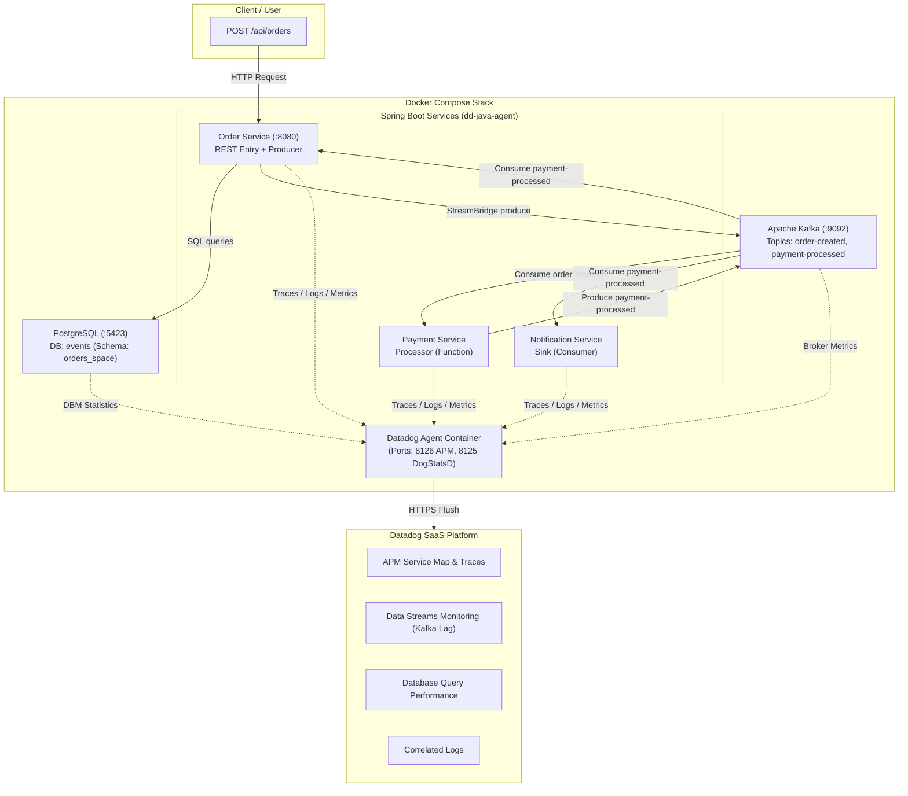

# Datadog Integration Plan & Guide for Spring Cloud Events

This document provides a comprehensive research summary of **Datadog**, its key observability concepts, and an actionable step-by-step plan to integrate Datadog APM, Data Streams Monitoring (DSM), Database Monitoring (DBM), Metrics, and Log Correlation into the **Spring Cloud Events** application.

---

## 1. Introduction to Datadog & Core Concepts

Datadog is a cloud-scale SaaS monitoring and security platform that unifies metrics, distributed traces, logs, synthetic tests, and security monitoring into a single pane of glass.

As a software engineer new to Datadog, the key concepts to understand for this application are:

### Core Pillars of Observability in Datadog

| Pillar                              | What It Does                                                                                                                             | Application Integration                                                                                                                 |
|:------------------------------------|:-----------------------------------------------------------------------------------------------------------------------------------------|:----------------------------------------------------------------------------------------------------------------------------------------|
| **APM & Distributed Tracing**       | Tracks the path of requests as they travel across REST endpoints and Kafka producers/consumers. Measures latency and errors per service. | Java Agent (`dd-java-agent.jar`) injected into JVMs. Auto-instruments Spring Web, Spring Cloud Stream, and Kafka.                       |
| **Data Streams Monitoring (DSM)**   | Provides end-to-end visibility into asynchronous message pipelines (Kafka). Measures producer-to-consumer latency and consumer lag.      | Enabled via `DD_DATA_STREAMS_ENABLED=true` in `dd-java-agent.jar`. Automatically tracks `order-created` and `payment-processed` topics. |
| **Database Monitoring (DBM)**       | Monitors PostgreSQL query performance, execution plans, active connections, and lock waits.                                              | Datadog Agent connects directly to Postgres (`events-db`) with `pg_monitor` read-only permissions.                                      |
| **Log Management & Correlation**    | Aggregates logs across services and links log lines to distributed trace IDs (`dd.trace_id`).                                            | `DD_LOGS_INJECTION=true` injects trace metadata into Logback MDC, allowing 1-click navigation from log to trace.                        |
| **Infrastructure & Custom Metrics** | Tracks host/container CPU, memory, JVM heap/GC metrics, and custom business metrics via Micrometer.                                      | Datadog Agent + `micrometer-registry-datadog` or DogStatsD.                                                                             |

---

## 2. Architecture & Data Flow



### Context Propagation across Kafka
When `Order Service` sends a message using `StreamBridge`, `dd-java-agent` automatically injects trace context headers (e.g., `x-datadog-trace-id`, `x-datadog-parent-id`) into the Kafka record headers. When `Payment Service` and `Notification Service` consume the message, the agent extracts these headers to continue the same distributed trace seamlessly.

---

## 3. Integration Plan

### Phase 1: Update Infrastructure (`compose.yml`)

Add the Datadog Agent container to `compose.yml`. The Agent collects telemetry from the Spring Boot containers, Kafka broker, and Postgres database.

#### `compose.yml` Changes

```yaml
services:
  # Datadog Agent Service
  datadog-agent:
    image: gcr.io/datadoghq/agent:7
    container_name: datadog-agent
    hostname: datadog-agent
    environment:
      - DD_API_KEY=${DD_API_KEY}
      - DD_SITE=${DD_SITE:-datadoghq.com} # Or datadoghq.eu
      - DD_APM_ENABLED=true
      - DD_APM_NON_LOCAL_TRAFFIC=true
      - DD_DOGSTATSD_NON_LOCAL_TRAFFIC=true
      - DD_LOGS_ENABLED=true
      - DD_LOGS_CONFIG_CONTAINER_COLLECT_ALL=true
      - DD_DATA_STREAMS_ENABLED=true
      - DD_PROCESS_AGENT_ENABLED=true
    volumes:
      - /var/run/docker.sock:/var/run/docker.sock:ro
      - /proc/:/host/proc/:ro
      - /sys/fs/cgroup:/host/sys/fs/cgroup:ro
    ports:
      - "8126:8126/tcp" # APM Tracer port
      - "8125:8125/udp" # DogStatsD port
    networks:
      - events
```

---

### Phase 2: PostgreSQL Database Monitoring (DBM) Setup

1. **Create Datadog DB User**: Add a Flyway migration script or setup script to create a `datadog` user in PostgreSQL with `pg_monitor` permissions:
   ```sql
   CREATE USER datadog WITH PASSWORD 'datadog_password';
   GRANT pg_monitor TO datadog;
   GRANT SELECT ON ALL TABLES IN SCHEMA public TO datadog;
   ```

2. **Configure Datadog Agent Autodiscovery Label for Postgres** in `compose.yml`:
   ```yaml
   events-db:
     image: 'postgres:18-alpine'
     container_name: events-db
     labels:
       com.datadoghq.ad.check_names: '["postgres"]'
       com.datadoghq.ad.init_configs: '[{}]'
       com.datadoghq.ad.instances: '[{
         "host": "events-db",
         "port": 5432,
         "username": "datadog",
         "password": "datadog_password",
         "dbname": "events",
         "dbm": true
       }]'
   ```

---

### Phase 3: Instrument Java Microservices (`order`, `payment`, `notification`)

#### 1. Download Datadog Java Agent
Download `dd-java-agent.jar` locally or include it in container builds:
```bash
curl -Lo dd-java-agent.jar https://dtdg.co/latest-java-tracer
```

#### 2. Update Service Build Configurations (`build.gradle`)
For custom business metrics via Micrometer (optional but recommended), add `micrometer-registry-datadog` to `order/build.gradle`, `payment/build.gradle`, and `notification/build.gradle`:

```groovy
dependencies {
    implementation 'io.micrometer:micrometer-registry-datadog'
    // existing dependencies...
}
```

#### 3. Standard Environment Variables per Service

When starting each Spring Boot service, pass `dd-java-agent.jar` as a `-javaagent` JVM flag along with uniform Unified Service Tagging (`env`, `service`, `version`):

##### Order Service (`order`):
```bash
java -javaagent:./dd-java-agent.jar \
  -Ddd.service=order-service \
  -Ddd.env=dev \
  -Ddd.version=1.0.0 \
  -Ddd.agent.host=localhost \
  -Ddd.agent.port=8126 \
  -Ddd.logs.injection=true \
  -Ddd.data.streams.enabled=true \
  -jar order/build/libs/order-1.0.0.jar
```

##### Payment Service (`payment`):
```bash
java -javaagent:./dd-java-agent.jar \
  -Ddd.service=payment-service \
  -Ddd.env=dev \
  -Ddd.version=1.0.0 \
  -Ddd.agent.host=localhost \
  -Ddd.agent.port=8126 \
  -Ddd.logs.injection=true \
  -Ddd.data.streams.enabled=true \
  -jar payment/build/libs/payment-1.0.0.jar
```

##### Notification Service (`notification`):
```bash
java -javaagent:./dd-java-agent.jar \
  -Ddd.service=notification-service \
  -Ddd.env=dev \
  -Ddd.version=1.0.0 \
  -Ddd.agent.host=localhost \
  -Ddd.agent.port=8126 \
  -Ddd.logs.injection=true \
  -Ddd.data.streams.enabled=true \
  -jar notification/build/libs/notification-1.0.0.jar
```

---

### Phase 4: Configure Log-to-Trace Correlation

To automatically correlate application logs with APM traces in Datadog:

1. Ensure `-Ddd.logs.injection=true` is set.
2. Update `logback-spring.xml` (or `application.yml` logging format) to include MDC attributes:

```xml
<configuration>
    <appender name="CONSOLE" class="ch.qos.logback.core.ConsoleAppender">
        <encoder>
            <pattern>
                %d{yyyy-MM-dd HH:mm:ss} [%thread] %-5level %logger{36} [dd.service=%X{dd.service} dd.env=%X{dd.env} dd.version=%X{dd.version} dd.trace_id=%X{dd.trace_id} dd.span_id=%X{dd.span_id}] - %msg%n
            </pattern>
        </encoder>
    </appender>
    <root level="INFO">
        <appender-ref ref="CONSOLE" />
    </root>
</configuration>
```

---

## 5. Verification & Validation Plan

### Automated / Local Commands

1. **Start Infrastructure with Datadog Agent**:
   ```bash
   export DD_API_KEY=<your-datadog-api-key>
   docker compose up -d
   ```

2. **Verify Datadog Agent Status**:
   ```bash
   docker exec -it datadog-agent agent status
   ```
   *Look for: APM Agent running on port 8126, Postgres check status OK, Data Streams Monitoring enabled.*

3. **Build Services**:
   ```bash
   ./order/gradlew -p order build
   ./payment/gradlew -p payment build
   ./notification/gradlew -p notification build
   ```

4. **Trigger End-to-End Event Flow**:
   ```bash
   curl -X POST http://localhost:8080/api/orders \
     -H "Content-Type: application/json" \
     -d '{
       "customerName": "Jane Doe",
       "totalAmount": 149.99
     }'
   ```

### What to Inspect in Datadog UI

1. **APM -> Service Catalog**:
   - `order-service`, `payment-service`, and `notification-service` will automatically register.
   - Flame graph showing request flow: `POST /api/orders` -> JPA `INSERT INTO orders` -> Kafka `StreamBridge.send()` -> Kafka `processOrder` -> Kafka `sendNotification`.

2. **Data Streams Monitoring (DSM)**:
   - Pipeline graph connecting `order-service` -> `order-created` topic -> `payment-service` -> `payment-processed` topic -> `notification-service` & `order-service`.
   - Latency & consumer lag metrics per topic.

3. **Database Monitoring (DBM)**:
   - Query metrics for `INSERT INTO orders` and `UPDATE orders`.
   - Explain plans and Postgres connection stats.

4. **Logs -> Trace Link**:
   - Clicking on any trace span opens matching container log entries filtered by `dd.trace_id`.

---

## 6. Engineering Best Practices Checklist

- [ ] **Unified Service Tagging**: Maintain consistent `env`, `service`, and `version` tags across container labels, JVM properties, and logs.
- [ ] **API Key Security**: Store `DD_API_KEY` in environment variables or standard secrets management (do not commit to Git).
- [ ] **Sampling Controls**: In high-throughput production environments, set `-Ddd.trace.sample.rate=0.5` or sample rules to manage ingest costs while preserving representational traces.
- [ ] **Health Check Endpoints**: Ensure `/actuator/health` endpoint is monitored via Datadog Synthetic HTTP checks.
