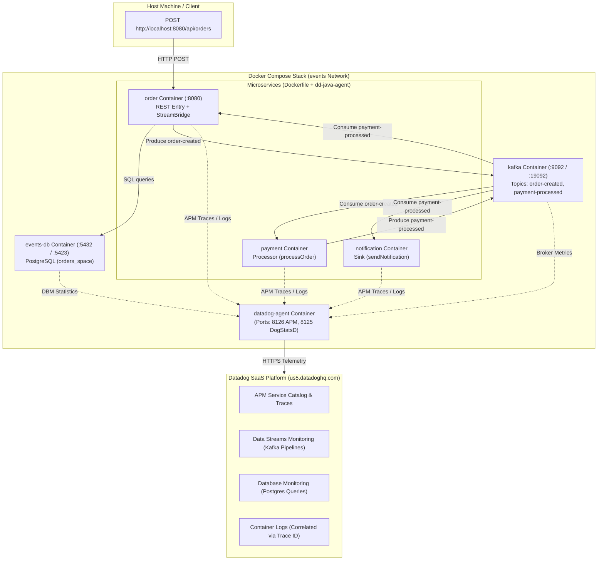

# Datadog Integration Plan & Guide for Spring Cloud Events (Containerized Stack)

This document provides a comprehensive research summary of **Datadog**, its key observability concepts, and an actionable step-by-step plan to integrate Datadog APM, Data Streams Monitoring (DSM), Database Monitoring (DBM), Metrics, and Log Correlation into the **Spring Cloud Events** application running entirely in **Docker Compose**.

---

## 1. Introduction to Datadog & Core Concepts

Datadog is a cloud-scale SaaS monitoring and security platform that unifies metrics, distributed traces, logs, synthetic tests, and security monitoring into a single pane of glass.

In this application, all microservices (`order`, `payment`, `notification`), infrastructure (`kafka`, `events-db`), and the Datadog Agent run as Docker containers managed by Docker Compose (`compose.yml`).

### Core Pillars of Observability in Datadog

| Pillar | What It Does | Containerized Application Integration |
| :--- | :--- | :--- |
| **APM & Distributed Tracing** | Tracks requests across REST endpoints, Spring Data JPA, and Kafka message flows. Measures end-to-end latency and errors. | Java Agent (`dd-java-agent.jar`) copied into runtime stage of each service `Dockerfile` from `gcr.io/datadoghq/dd-lib-java-init:latest` and activated via `JAVA_TOOL_OPTIONS`. |
| **Data Streams Monitoring (DSM)** | Provides end-to-end visibility into Kafka message pipelines. Tracks producer-to-consumer latency and consumer lag. | Enabled via `DD_DATA_STREAMS_ENABLED=true` in `compose-config.yml`. Automatically traces `order-created` and `payment-processed` topics. |
| **Database Monitoring (DBM)** | Monitors PostgreSQL query performance, execution plans, connection pools, and lock waits. | Datadog Agent connects directly to `events-db` container using Docker Autodiscovery labels and `pg_monitor` read-only user. |
| **Log Management & Correlation** | Aggregates container stdout/stderr logs and correlates log lines to distributed trace IDs (`dd.trace_id`). | `DD_LOGS_INJECTION=true` injects trace metadata into Logback MDC. Datadog Agent collects container logs via `/var/run/docker.sock`. |
| **Infrastructure & Container Metrics** | Tracks host and container CPU, memory, network I/O, JVM GC/heap metrics, and custom business metrics. | Datadog Agent inspects Docker daemon socket and receives DogStatsD / Micrometer metrics on port `8125`. |

### Datadog Credentials Guide: API Keys vs. PATs vs. Application Keys

Datadog uses standard `DD_` prefixed environment variables across all agents and SDKs:

#### 1. Datadog API Key (`DD_API_KEY`) — Required for Docker Agent
- **Purpose**: Used by the `datadog-agent` container to authenticate and submit telemetry data (metrics, APM traces, container logs) to Datadog's ingest endpoints.
- **Where to Get It (US5 Region / Student Pack)**:
  1. Log in to Datadog ([us5.datadoghq.com](https://us5.datadoghq.com)).
  2. In the left navigation bar, go to **Organization Settings** (gear icon) -> **API Keys** (Direct link: `https://us5.datadoghq.com/organization-settings/api-keys`).
  3. Click **+ New Key** (or copy an existing active API Key).
- **How to Use**: Set `export DD_SITE=us5.datadoghq.com` and `export DD_API_KEY=<your_api_key>` before running `docker compose up`.

#### 2. Personal Access Tokens (PATs) — Recommended for REST API & Automation
- **Purpose**: Used for **programmatic REST API access** to query Datadog resources, manage dashboards/monitors via code, or automate setups via Terraform/CI/CD.
- **Why Datadog recommends PATs**: PATs replace legacy Application Keys with fine-grained scoping tied to your user identity and specific role permissions.
- **Where to Get It**:
  1. Go to **Organization Settings** (or **Personal Settings**) -> **Personal Access Tokens** (Direct link: `https://us5.datadoghq.com/organization-settings/personal-access-tokens`).
  2. Click **+ Create Token**, assign the required scopes (e.g. `monitors_read`, `dashboards_write`), and save the token securely.

#### 3. Application Keys (Legacy)
- **Purpose**: Previously used alongside API Keys for REST API operations. Datadog recommends migrating to PATs for enhanced security and scoped access.

> [!IMPORTANT]
> Because your account is hosted on the **US5 region** (`us5.datadoghq.com`), the Agent container **must** be configured with `DD_SITE=us5.datadoghq.com`. For container telemetry ingestion in Docker Compose, the `datadog-agent` container **requires an API Key (`DD_API_KEY`)**, NOT a PAT or Application Key.

---

## 2. Containerized Architecture & Data Flow



---

## 3. Integration Architecture & Steps

### Step 1: Update Service `Dockerfile`s
In `order/Dockerfile`, `payment/Dockerfile`, and `notification/Dockerfile`, copy `dd-java-agent.jar` from the official Datadog init image during the second (runtime) stage:

```dockerfile
# Runtime stage
FROM eclipse-temurin:25-jre-alpine

# Copy Datadog Java Agent from official image
COPY --from=gcr.io/datadoghq/dd-lib-java-init:latest /dd-java-agent.jar /app/dd-java-agent.jar

RUN addgroup -S -g 1000 events && \
    adduser -S -u 1000 -G events events && \
    mkdir -p /app && \
    chown -R events:events /app

USER events
WORKDIR /app
COPY --from=build /app/build/libs/*.jar app.jar
EXPOSE 8080
ENTRYPOINT ["java", "-jar", "app.jar"]
```

---

### Step 2: Configure Shared Microservice Environment (`compose-config.yml`)
Add standard Datadog environment variables and `JAVA_TOOL_OPTIONS` to `compose-config.yml`:

```yaml
services:
  shared-network:
    networks:
      - events
  microservice-base:
    extends:
      service: shared-network
    deploy:
      resources:
        limits:
          memory: 700m
    environment:
      - KAFKA_BROKER=kafka:19092
      - DD_AGENT_HOST=datadog-agent
      - DD_TRACE_AGENT_PORT=8126
      - DD_ENV=dev
      - DD_LOGS_INJECTION=true
      - DD_DATA_STREAMS_ENABLED=true
      - JAVA_TOOL_OPTIONS=-javaagent:/app/dd-java-agent.jar
```

In individual microservice compose files, specify unified service tags using `DD_SERVICE` and `DD_VERSION`:
- `order/compose.yml`: `DD_SERVICE=order-service`, `DD_VERSION=1.0.0`
- `payment/compose.yml`: `DD_SERVICE=payment-service`, `DD_VERSION=1.0.0`
- `notification/compose.yml`: `DD_SERVICE=notification-service`, `DD_VERSION=1.0.0`

---

### Step 3: Add `compose.datadog.yml` & Include in Root `compose.yml`

Create `compose.datadog.yml` defining the Datadog Agent container using standard `DD_` variables:

```yaml
services:
  datadog-agent:
    image: gcr.io/datadoghq/agent:7
    container_name: datadog-agent
    hostname: datadog-agent
    environment:
      - DD_API_KEY=${DD_API_KEY}
      - DD_SITE=${DD_SITE:-us5.datadoghq.com}
      - DD_APM_ENABLED=true
      - DD_APM_NON_LOCAL_TRAFFIC=true
      - DD_DOGSTATSD_NON_LOCAL_TRAFFIC=true
      - DD_LOGS_ENABLED=true
      - DD_LOGS_CONFIG_CONTAINER_COLLECT_ALL=true
      - DD_DATA_STREAMS_ENABLED=true
      - DD_PROCESS_AGENT_ENABLED=true
    volumes:
      - /var/run/docker.sock:/var/run/docker.sock:ro
      - /proc/:/host/proc/:ro
      - /sys/fs/cgroup:/host/sys/fs/cgroup:ro
    ports:
      - "8126:8126/tcp"
      - "8125:8125/udp"
    extends:
      file: compose-config.yml
      service: shared-network
```

Include `compose.datadog.yml` in root `compose.yml`:

```yaml
include:
  - ./compose.kafka.yml
  - ./compose.db.yml
  - ./compose.datadog.yml
  - ./order/compose.yml
  - ./payment/compose.yml
  - ./notification/compose.yml
```

---

### Step 4: Configure PostgreSQL Database Monitoring (DBM)
In `compose.db.yml`, add Autodiscovery labels so Datadog Agent automatically discovers and monitors PostgreSQL queries:

```yaml
services:
  events-db:
    image: 'postgres:18-alpine'
    container_name: events-db
    labels:
      com.datadoghq.ad.check_names: '["postgres"]'
      com.datadoghq.ad.init_configs: '[{}]'
      com.datadoghq.ad.instances: '[{
        "host": "events-db",
        "port": 5432,
        "username": "datadog",
        "password": "datadog_password",
        "dbname": "events",
        "dbm": true
      }]'
```

Add a Flyway script `V2__datadog_dbm_user.sql` in `order/src/main/resources/db/migration/`:
```sql
CREATE USER datadog WITH PASSWORD 'datadog_password';
GRANT pg_monitor TO datadog;
GRANT SELECT ON ALL TABLES IN SCHEMA orders_space TO datadog;
```

---

### Step 5: Configure Logback MDC Correlation
Add `logback-spring.xml` to `src/main/resources/` in `order`, `payment`, and `notification`:

```xml
<configuration>
    <appender name="CONSOLE" class="ch.qos.logback.core.ConsoleAppender">
        <encoder>
            <pattern>
                %d{yyyy-MM-dd HH:mm:ss.SSS} [%thread] %-5level %logger{36} [dd.service=%X{dd.service} dd.env=%X{dd.env} dd.version=%X{dd.version} dd.trace_id=%X{dd.trace_id} dd.span_id=%X{dd.span_id}] - %msg%n
            </pattern>
        </encoder>
    </appender>
    <root level="INFO">
        <appender-ref ref="CONSOLE" />
    </root>
</configuration>
```

---

## 4. Verification & Validation Plan

1. **Launch the Container Stack**:
   ```bash
   export DD_API_KEY=<your-api-key>
   export DD_SITE=us5.datadoghq.com

   docker compose up -d --build
   ```

2. **Verify Agent Status**:
   ```bash
   docker exec -it datadog-agent agent status
   ```
   *Verify: APM Agent active on 8126, Docker Autodiscovery active, Postgres DBM check OK.*

3. **Execute Event Workflow**:
   ```bash
   curl -X POST http://localhost:8080/api/orders \
     -H "Content-Type: application/json" \
     -d '{"customerName": "Jane Doe", "totalAmount": 149.99}'
   ```

4. **Datadog UI Inspection**:
   - **APM Service Catalog**: `order-service`, `payment-service`, `notification-service` active with trace flamegraphs.
   - **Data Streams Monitoring**: End-to-end topology graph showing `order` -> `order-created` -> `payment` -> `payment-processed` -> `notification`.
   - **Database Monitoring**: Slow query analysis and execution plans for `orders` table.
   - **Log Explorer**: Trace ID links directly to matching microservice container logs.
